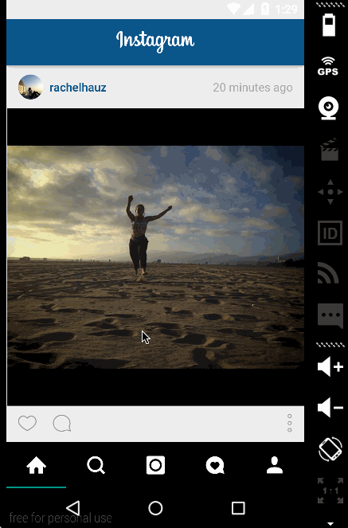

# Assignment 5 - *Instagram*

**Instagram** is an android app that allows viewing your friends pictures through social media.

Submitted by: **Matt Rucker**

Time spent: **6** hours spent in total

The following user stories are **required**:

* [x] Add the Profile Page to your TabLayout to see your own posts, follower count, following count.
* [x] Add the ability to see a your photos below the profile information
* [x] Clicking on any user's profile image goes to that user's profile page.
* [x] Replace the ActionBar with a ToolBar and style it to match the actual Instagram app.
* [x] Add infinite scroll to your home feed.

The following user stories are **optional**:

* [ ] Style the TabLayout to match the actual Instagram app.
* [ ] Show a special view when the search results RecyclerView is empty.

## Video Walkthrough 

Here's a walkthrough of implemented user stories:

GIF created with [LiceCap](http://www.cockos.com/licecap/).

# Assignment 4 - *Instagram*

**Instagram** is an android app that allows viewing your friends pictures through social media.

Submitted by: **Matt Rucker**

Time spent: **6** hours spent in total

## User Stories
The following user stories **must** be completed:

* [x] Add pull-to-refresh for the home feed with SwipeRefreshLayout.
* [x] User can open the Instagram client offline and see last loaded feed.
* [x] Create a background service to make the network request, load items into the DB and populate the view (for the user's home feed).

## Video Walkthrough 

Here's a walkthrough of implemented user stories:

GIF created with [LiceCap](http://www.cockos.com/licecap/).

# Assignment 3 - *Instagram*

**Instagram** is an android app that allows viewing your friends pictures through social media.

Submitted by: **Matt Rucker**

Time spent: **12** hours spent in total

## User Stories
The following user stories **must** be completed:

* [x] User can login to Instagram using OAuth login.
* [x] User can view their own feed.
* [x] User can search for a user by username.
* [x] User can search for a tag.

The following user stories are **optional**:

* [ ] Include a ProgressBar during network loading.
* [x] User can get a grid of photos by clicking on a search result (i.e. a user or tag).

## Video Walkthrough 

Here's a walkthrough of implemented user stories:

GIF created with [LiceCap](http://www.cockos.com/licecap/).

# Assignment 2 - *Instagram*

**Instagram** is an android app that allows viewing your friends pictures through social media.

Submitted by: **Matt Rucker**

Time spent: **6** hours spent in total

## User Stories
The following user stories **must** be completed:

* [x] Connect the app with the Instagram API and get real time data using async-http-client library.
* [x] Show the last 2 comments for each photo.
* [x] User can view all comments for a post within a separate activity.
* [x] User can share an image to their friends or email to themselves.

The following user story is **optional**:

* [x] Robust error handling, check if internet is available, handle network failures.

## Video Walkthrough 

Here's a walkthrough of implemented user stories:

GIF created with [LiceCap](http://www.cockos.com/licecap/).

# Assignment 1 - *Instagram*

**Instagram** is an android app that allows viewing your friends pictures through social media.

Submitted by: **Matt Rucker**

Time spent: **5** hours spent in total

## User Stories

The following **required** functionality is completed:

* [x] User can scroll through the popular posts from Instagram
* For each post displayed, user can see the following details:
  * [x] Graphic, Caption, Username, User profile image
  * [x] Relative timestamp, Like count

* [x] Display each user profile image as a circle.
* [x] Display a nice default placeholder graphic for each image during loading.

The following user story is **optional**:

* [x] Display each post with the same style and proportions as the real Instagram (design mock up provided below).

## Video Walkthrough 

Here's a walkthrough of implemented user stories:

GIF created with [LiceCap](http://www.cockos.com/licecap/).
